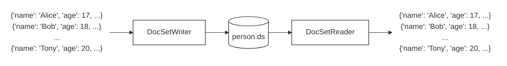

# DocSet (Document Dataset)

The project contains writer and reader utilities to store and extract documents (python dict) by a single ".ds" file as follow:



## Installation

* Install from PyPI repository.

   ```bash
   pip3 install docset
   ```


## Tutorial

Here, we give an example on a very simple machine learning task. Suppose we want to train a model to perform an image classification task, one important step is to construct a train dataset. To achieve this, we usually use a text file (e.g., csv, json) to store the "image path" and "label" information, and we store all the actual image files in another folder. This "text+folder" dataset can be fine in most of the situations, while it will suffer poor performance when the total number of samples is very large. The reason is that the file system is not good at reading/writing huge numbers of tiny files which are separately stored on the disk. So, storing the whole dataset in a single file is one possible way to solve this problem. 

The following examples first show how to make a DocSet file based on the "text+folder" storage, and then show how to read or iterate this dataset.

### Make a Dataset

```python
import csv
import os

import cv2 as cv
import numpy as np

from docset import DocSet

csv_path = 'train.csv'
image_dir_path = 'images'
ds_path = 'train.ds'

with csv.DictReader(csv_path) as reader, DocSet(ds_path, 'w') as ds:
    for row in reader:
        image_path = os.path.join(image_dir_path, row['filename'])
        image = cv.imread(image_path, cv.IMREAD_COLOR)  # load the image as ndarray
        doc = {
            'feature': image.astype(np.float32) / 255.0,  # convert the image into [0, 1] range
            'label': row['label']
        }  # a data sample is represented by dict, ndarray can be used directly
        ds.write(doc)

```

### Read the Dataset

```python
from docset import DocSet

ds_path = 'train.ds'

with DocSet(ds_path, 'r') as ds:
    print(len(ds), 'samples')
    doc = ds[0]  # the sample can be access by subscript, a dict will be returned
    print('feature shape', doc['feature'].shape)
    print('feature dtype', doc['feature'].dtype)
    print('label', doc['label'])

```

### View the Dataset in Console

```bash
docset /path/to/the/file.ds
```


### Integrate with Pytorch

```python
from torch.utils.data import Dataset, DataLoader

from docset import DocSet


class MyDataset(Dataset):

    def __init__(self, path):
        self._impl = DocSet(path, 'r')

    def __len__(self):
        return len(self._impl)

    def __getitem__(self, i: int):
        doc = self._impl[i]
        # perform any data processing
        return doc


ds_path = 'train.ds'

train_loader = DataLoader(
    MyDataset(ds_path),
    batch_size=256,
    shuffle=True,
    num_workers=5,
    pin_memory=True
)

for epoch in range(50):
    for doc in train_loader:
        feature = doc['feature']
        label = doc['label']
        # invoke the train function of the model
        # model.train(feature, label)

```

## Technical Details

To be added...